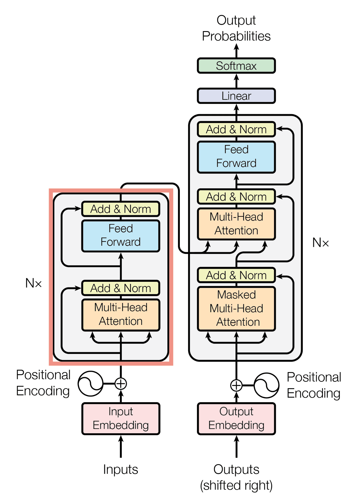

# Transformers Models
## What can they do? 
**Transformers,_what_can_they_do_.ipynb**- It provides an overview of transformers and their widespread use in various NLP tasks. It introduces the concept of **pipelines** in the Hugging Face Transformers library, which connect models with preprocessing and postprocessing steps. It explains how pipelines can be used for tasks such as **sentiment analysis, zero-shot classification, text generation, mask filling, named entity recognition, question answering, summarization, and translation**. Examples and code snippets are provided to demonstrate the usage of these pipelines. It also highlights the availability of pretrained models in the **Hugging Face Model Hub** and the option to upload custom models. It concludes by mentioning the **Inference API**.


## How do Transformers work?
All the Transformer models such as (GPT, BERT, BART, T5, etc.) have been trained as language models. They have been trained on large amounts of raw text in a **self-supervised** fashion. For specific pratical tasks, the general pretrained model then goes through a process called **transfer learning**. Broadly, transformer models can be grouped into three categories:-
1. GPT-like (also called **auto-regressive** Transformer models)
2. BERT-like (also called **auto-encoding** Transformer models)
3. BART/T5-like (also called **sequence-to-sequence** Transformer models)

### Architecture
The model is primarily composed of two blocks:
1. Encoder: The encoder receives an input and builds a representation of it (its features).   
2. Decoder: The decoder uses the encoder’s representation (features) along with other inputs to generate a target sequence.  

Each of these parts can be used independently, depending on the task:
1. Encoder-only models: Good for tasks that require understanding of the input, such as sentence classification and named entity recognition.
2. Decoder-only models: Good for generative tasks such as text generation.
3. Encoder-decoder models or sequence-to-sequence models: Good for generative tasks that require an input, such as translation or summarization.

#### Original Architecture
The Transformer architecture was originally designed for translation. During training, the encoder receives inputs (sentences) in a certain language, while the decoder receives the same sentences in the desired target language. In the encoder, the attention layers can use all the words in a sentence (since, as we just saw, the translation of a given word can be dependent on what is after as well as before it in the sentence). The decoder, however, works sequentially and can only pay attention to the words in the sentence that it has already translated.

During training, the encoder receives inputs (sentences) in a certain language, while the decoder receives the same sentences in the desired target language. In the encoder, the attention layers can use all the words in a sentence (since, as we just saw, the translation of a given word can be dependent on what is after as well as before it in the sentence). The decoder, however, works sequentially and can only pay attention to the words in the sentence that it has already translated



Note that the first attention layer in a decoder block pays attention to all (past) inputs to the decoder, but the second attention layer uses the output of the encoder. It can thus access the whole input sentence to best predict the current word. This is very useful as different languages can have grammatical rules that put the words in different orders, or some context provided later in the sentence may be helpful to determine the best translation of a given word.

The attention mask can also be used in the encoder/decoder to prevent the model from paying attention to some special words — for instance, the special padding word used to make all the inputs the same length when batching together sentences.

**Architecture vs Checkpoints**
1. Architecture: This is the skeleton of the model — the definition of each layer and each operation that happens within the model.
2. Checkpoints: These are the weights that will be loaded in a given architecture.
3. Model: This is an umbrella term that isn’t as precise as “architecture” or “checkpoint”: it can mean both. This course will specify architecture or checkpoint when it matters to reduce ambiguity.

## Encoder Models
Encoder models use only the encoder of a Transformer model. These models are often characterized as having “bi-directional” attention, and are often called auto-encoding models. The pretraining of these models usually revolves around somehow corrupting a given sentence (for instance, by masking random words in it) and tasking the model with finding or reconstructing the initial sentence.

Encoder models are best suited for tasks requiring an understanding of the full sentence, such as sentence classification, named entity recognition (and more generally word classification), and extractive question answering. This family of models include:- ALBERT, BERT, ELECTRA, RoBERTa


## Decoder Models
Decoder models use only the decoder of a Transformer model. At each stage, for a given word the attention layers can only access the words positioned before it in the sentence. These models are often called auto-regressive models. The pretraining of decoder models usually revolves around predicting the next word in the sentence.

These are best suited for tasks involving **text generation**. This family of models include:- CTRL, GPT, GPT-2 and Transformer XL 


## Sequence-to-Sequence Models
They use both parts of the Transformer architecture. At each stage, the attention layers of the encoder can access all the words in the initial sentence, whereas the attention layers of the decoder can only access the words positioned before a given word in the input.

Sequence-to-sequence models are best suited for tasks revolving around generating new sentences depending on a given input, such as summarization, translation, or generative question answering. This family of models include:- BART, mBART, Marian, T5.

## Bias and Limitations
 To enable pretraining on large amounts of data, researchers often scrape all the content they can find, taking the **best as well as the worst of what is available on the internet**. Below is one example where the model gives only one gender-free answer (waiter/waitress).:-
```
from transformers import pipeline

unmasker = pipeline("fill-mask", model="bert-base-uncased")
result = unmasker("This man works as a [MASK].")
print([r["token_str"] for r in result])

result = unmasker("This woman works as a [MASK].")
print([r["token_str"] for r in result])
```
```
['lawyer', 'carpenter', 'doctor', 'waiter', 'mechanic']
['nurse', 'waitress', 'teacher', 'maid', 'prostitute']
```
When you use these tools, you therefore need to keep in the back of your mind that the original model you are using could very easily generate sexist, racist, or homophobic content. Fine-tuning the model on your data won’t make this intrinsic bias disappear. A less obvious source of bias is the way the model is trained. Your model will blindly optimize for whatever metric you chose, without any second thoughts.