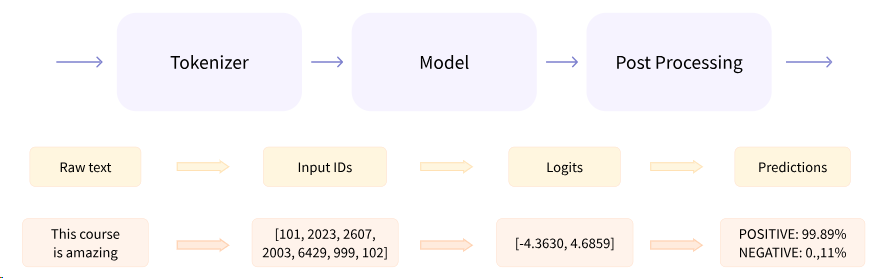
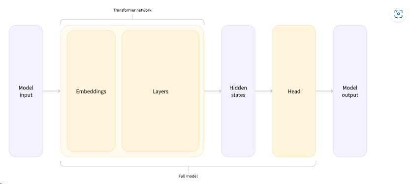

# Using Transformers
Transformer models are usually very large with millions to tens of billions of parameters; training and deploying these models is a complicated undertaking. Furthermore, with new models being released on a near-daily basis, trying them all out is no easy task.

The 🤗 Transformers library was created to solve this problem. Its goal is to provide a single API through which any Transformer model can be loaded, trained, and saved. The library’s main features are:

1. Ease of use: Downloading, loading, and using a state-of-the-art NLP model for inference can be done in just two lines of code.
2. Flexibility: At their core, all models are simple PyTorch nn.Module or TensorFlow tf.keras.Model classes and can be handled like any other models in their respective machine learning (ML) frameworks.
3. Simplicity: Hardly any abstractions are made across the library. The “All in one file” is a core concept: a model’s forward pass is entirely defined in a single file. Unlike other ML frameworks, the models are not built on modules that are shared across files; instead, each model has its own layers. 

## Behind the pipeline
**Behind_the_pipeline_(PyTorch.ipynb)** - The notebook provides a complete example of using the HuggingFace library for sentiment analysis. It demonstrates the three steps of the pipeline: preprocessing, passing inputs through the model, and postprocessing.

1. **Tokenizer**- It is responsible for splitting the input into words, subwords, or symbols (like punctuation) that are called tokens, mapping each token to an integer and adding additional inputs like padding. Use **AutoTokenizer** class to load any tokenizer given model or pipeline. 
2. **Model**- It contains the base Transformer module which give **hidden states** as output. Use **AutoModel** to load the base model.
3. **Head**- The model heads take the high-dimensional vector of hidden states as input and project them onto a different dimension. There are differnt classes based on the task like **AutoModelForSequenceClassification** for sequence classification head.
4. **Post Processing**- Conversion of raw logits into classes, scores etc.  

## Models
TODO

## Tokenizer
TODO

